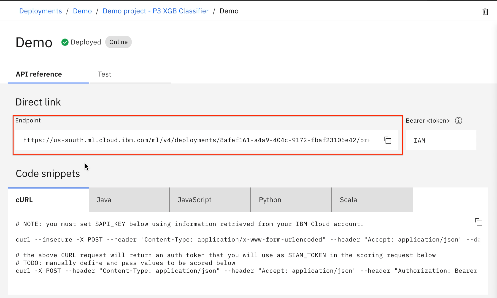
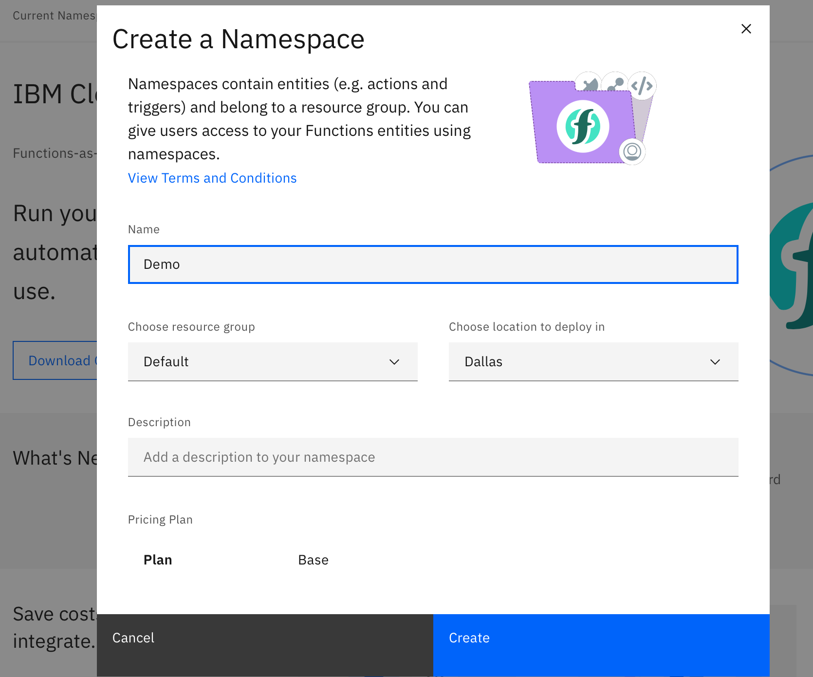
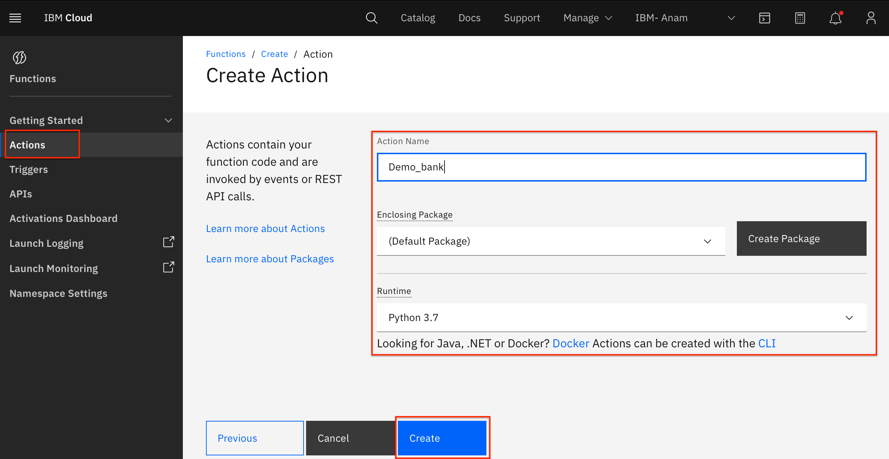
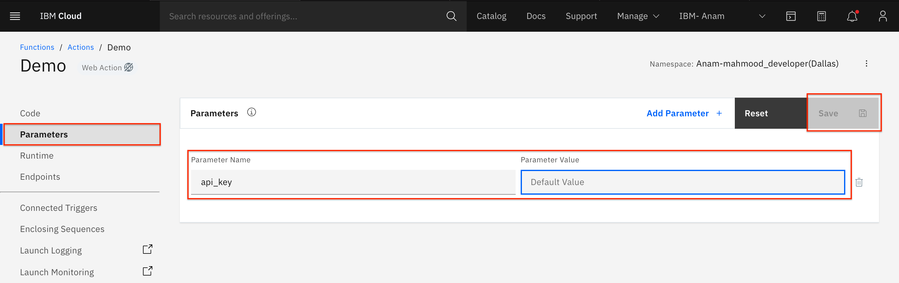
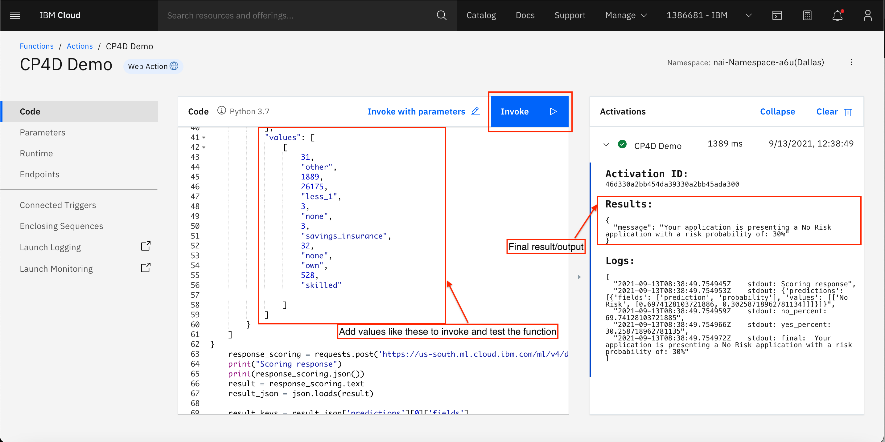
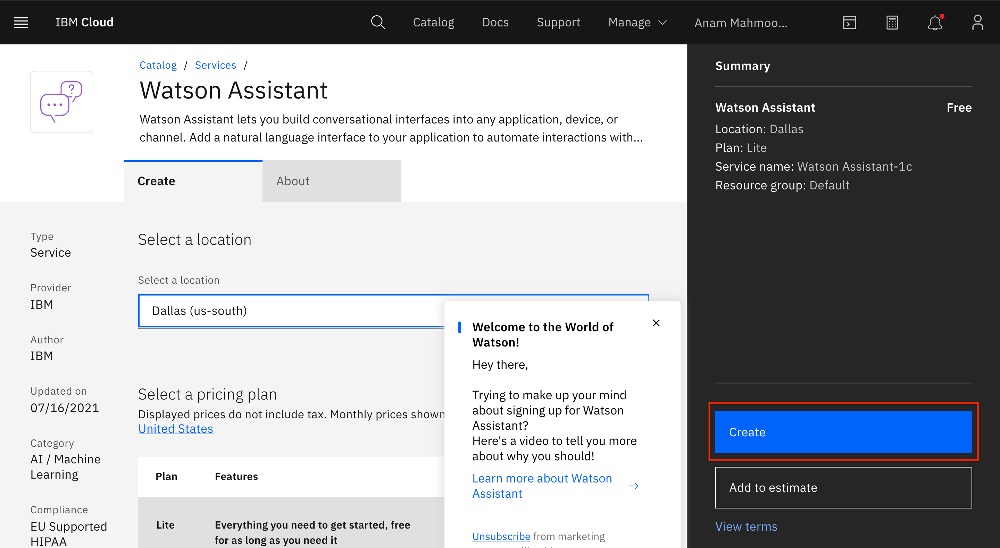
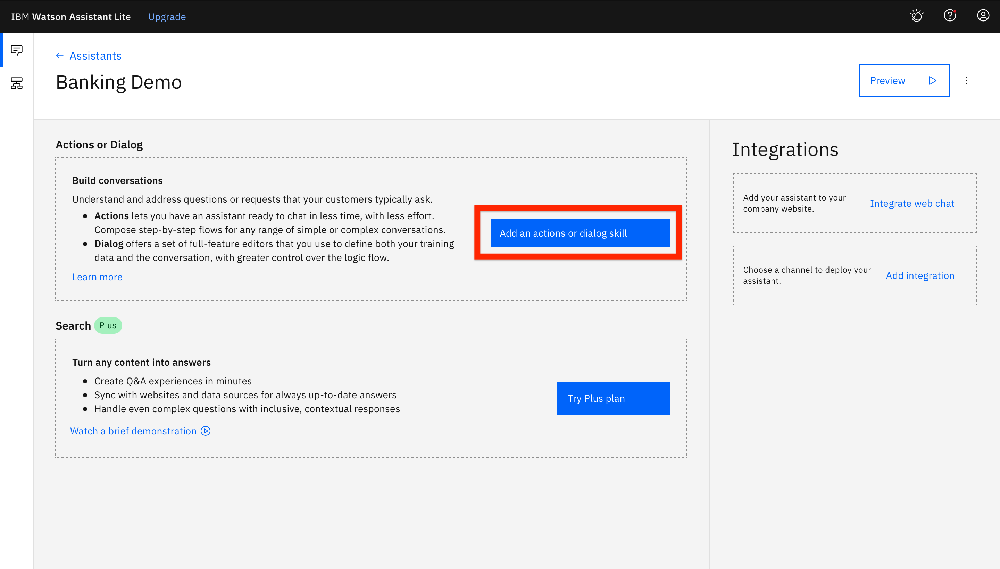
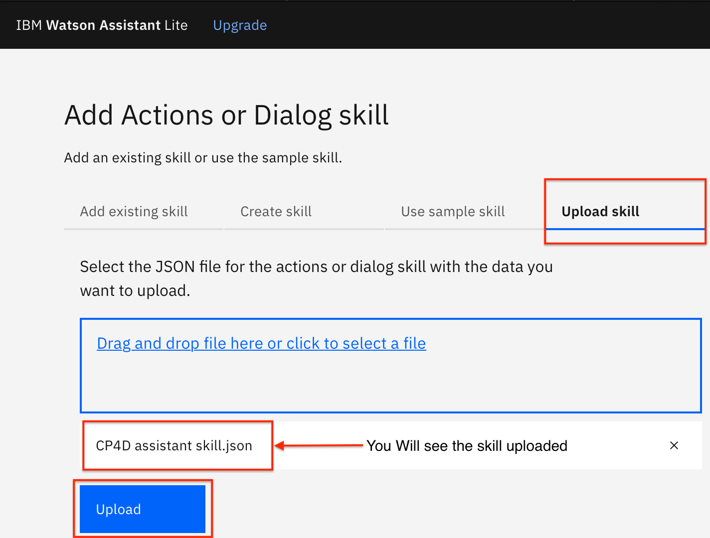
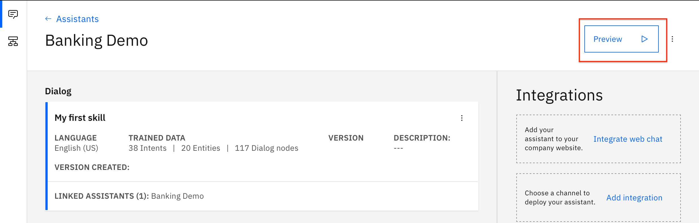
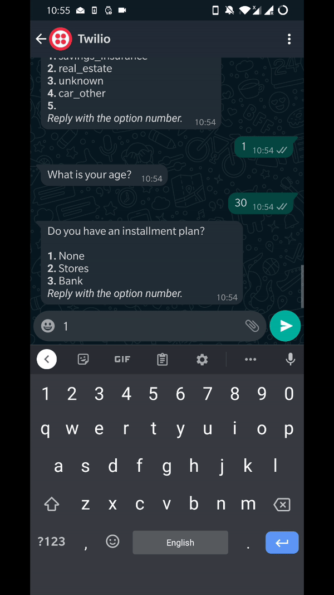

# Connect your Machine Learning models to chatbot and WhatsApp


In a bank's loan department, a customer's application can undergo a lengthy process before it is approved or rejected. This process can be so time-consuming that customers often switch to other competitors, resulting in a loss for the bank. However, you can use machine learning solutions to reduce the time it takes to make these decisions and increase the accuracy of the decisions being made -- thereby increasing your customer base. If you implement machine learning the right way, it can also help mitigate bias. In addition, you can use chatbots to increase productivity and provide a better customer experience. Chatbots can improve the customer journey at various stages by responding quickly and efficiently to frequently asked questions or by seamlessly escalating requests with the full context of the query to a human agent.

This tutorial shows you how to automate the loan application process using:

* Watson Studio to help generate machine learning pipelines and train the model to predict better.
* IBM Cloud Functions to help run your application code without servers, scale it automatically, and pay nothing when it's not in use.
* Watson Assistant chatbot's capabilities to connect it to WhatsApp using Twilio. You'll use Twilio's sandbox to see how this integration works. Watson Assistant also helps expand the user base because it makes the application more accessible.

## Prerequisites

To follow along with this tutorial, you need the following:

* An <a href="https://cloud.ibm.com/registration?cm_sp=ibmdev-_-developer-tutorials-_-cloudreg" target="_blank" rel="noopener noreferrer">IBM Cloud account</a>
* A <a href="https://ibm.biz/tryTwilio" target="_blank" rel="noopener noreferrer">Twilio account</a>
* Access to the <a href="https://github.com/IBM/Connect-your-Machine-Learning-models-to-chatbot-and-WhatsApp" target="_blank" rel="noopener noreferrer">GitHub repository</a> for this tutorial

## Create the Watson Studio service

First, you create the IBM Watson Studio and IBM Object Storage services. Then, you create a project and upload a data set to the project.

1. Log in to your IBM Cloud account.
2. Enter `Watson Studio` in the Search resources field, and then click **Watson Studio**.
3. On the Watson Studio service page, select a location, click the **Lite** plan (free), and give your service a unique name. Accept the license agreement terms and click **Create** to create a Watson Studio instance. When the service instance is ready, you are redirected to the Watson Studio page.
4. Click **Launch in IBM Cloud Pak for Data** to launch Watson Studio in a new tab. It might take few minutes to set up the service. 
5. Under **Work with data**, click **Create a project** and then click **Create an empty project**.
  
6. On the New project page, enter a name for your project. You also need to associate an IBM Cloud Object Storage instance to store the data set.
7. Under Select Storage Service, click **Add**. On the IBM Cloud Object Store service page, leave the service on the Lite tier and click **Create** at the bottom of the page. Name the service, choose the resource group, and click **Create**.
8. On the Project overview page, click the **Manage** tab, and you should see your newly created Cloud Object Storage instance under **Storage**.
9. Click **0100** on the top-right corner of the page. In the column on the right, click **Browse**. Navigate to the folder where you downloaded the data set and select final_german_credit_data_2.csv.
10. Watson Studio takes a couple of seconds to load the data, and then you should see that the import has completed. To make sure it has worked properly, click on the final_german_credit_data_2.csv file under **Data Assets**. 
  

### Create and run an AutoAI experiment

In this section, you create a machine learning instance, connect it to your project, and then create and run an AutoAI experiment.

1. On the **Assets** tab, click **Add to project** and then click **AutoAI experiment**.
1. On the Create an AutoAI project window, name your project.
1. To add a Watson Machine Learning instance, click **Associate a Machine Learning service instance**.
1. On the Associate service page, click **New Service**. From the pop-up screen, click **Machine Learning**.
1. Select the appropriate region. It is recommended that you build your machine learning service instance in the same region that you created your Watson Studio service. Select the **Lite** plan (free). Give your instance a unique name and click **Create**.
1. On the Associate service page, select the checkbox for your machine learning service instance and then click **Associate service**.
1. When the service is successfully associated, you are redirected to a new AutoAI experiment page. Click **Reload** on the right side of the screen. You should see your newly created machine learning instance. Click **Create** on the bottom right part of your screen to create your first AutoAI experiment.
  
1. After you create your experiment, you can add a data source to your project. Click **Select from project** and add the new_german_data.csv file. Click **Select asset** to confirm your data source.
1. After AutoAI processes your data, select the **Risk** as the Prediction column in the What do you want to predict section.
1. Next, let's explore the AutoAI settings to see what you can customize when running your experiment. Click **Experiment settings**. On the **Prediction** tab, you can select from Binary Classification, Regression, and Multiclass Classification.
1. On the **Data source** tab, you can omit certain columns from your experiment. Leave all of the columns. You can also select the training data split, which defaults to 85% training data. The **Data source** tab also shows which metric you optimize for. For the Binary classification, and for other types of experiments such as regression, it is Root Mean Squared Error (RMSE); AutoAI defaults to Accuracy for the optimized metric. Either way, you can change the metric from this tab depending on your use case.
1. Depending on your use case, change any other experiment details on the **Runtime** tab from the Experiment settings.
1. When you are happy with your settings, check that you are predicting for expenses and then click **Run Experiment** on the bottom-right corner of the screen.
  

  Your AutoAI experiment runs on its own. You see a progress map on the right side of the screen that shows which stage of the experiment is running. This could be Hyperparameter Optimization, feature engineering, or some other stage.
  
  You have different pipelines that are created, and you see the rankings of each model. Each model is ranked based on the metric that you selected. In this specific case, that is accuracy. Given that you want that number to be as high as possible, you can see that in the experiment, the model with the highest accuracy is at the top of the leaderboard.

  When the experiment is finished, you see a message that the experiment completed under the Progress map on the right-hand side of the screen. The AutoAI has successfully generated 8 different models.

1. In our case, you see the accuracy value is 0.785, from Pipeline 8. Click on **Pipeline 8**.
1. On the left-hand side, you can see different model evaluation measures. For this particular model, you can view the ROC curve, the model evaluation, and the feature summary.
1. Click **Feature Summary**. You can see here that the most important predictor of the loan eligibility is the duration of the new feature created by AutoAI. This is by far the most important feature, followed by age.

### Create a deployment and test your model

1. When you are ready to deploy one of the models, click **Save As** at the top-right corner of the model you want to deploy. Save it as a model, name it, and click **Create**.
1. When the model is successfully saved, click **View in project** in the green notification on the right side of the screen. Alternatively, you can also find your model saved in the Assets tab under Models.
1. Next, you see the overview of the model you just saved. Click **Promote to deployment space** on the top-right corner of your screen. Alternatively, if you're doing this from the Assets tab, then under the Models section, click on the 3 dots on the right side of your screen and click **Promote**.
1. On the Promote to space page, you need a target space to promote your model. Click **New space +** on the right side of your screen.
1. On the Create a deployment space screen, give your space a name, make sure the correct Cloud object storage is selected, and choose your machine learning service instance. For this experiment, selecting the machine learning service is mandatory because you need to build a prediction model. Click **Create**.
1. When the space is ready, close the pop-up window and you are redirected to the Promote to space page. You see your newly created space under the Target space. When you're happy with your selections, click **Promote**.
  
1. When the model is successfully promoted, in the green notification box, click on the deployment space. Alternatively, you can also find your deployment spaces when you click on the hamburger sign on the top left most side on your screen.
1. You are redirected to the Deployments page, where you can find your promoted model. Hover your mouse pointer over the row to see a rocket shaped icon, and then click on the icon to deploy your model.
1. In the dialog box, select **Online** as your deployment type, give your deployment a name, and click **Create**.
1. Click the Deployments tab to see the status of your deployment.
1. When the deployment is completed, click on the name of your deployment. On this page, you find the API references, endpoint, and code snippets to help you integrate your model with your applications. Copy the endpoint of your model and save it (you need it later).
  
1. To test your model, click the Test tab. You can select a row from the data set and enter the data in the fields. Enter the values from the data set, and then click **Add to Predict** and then click **Predict**.
  

## Set up IBM Cloud Functions

In this section, you create IBM Cloud functions that can help you run your application quickly without creating a full-fledged application. They can also help you to easily connect your machine learning model to Watson Assistant.

### Create the API key

1. Click **Manage** next to your account name, and in the drop-down list, click **Access (IAM)**.
  
1. Click **API keys** on the left.
1. Click **Create** and give a name to the API key. Copy and save the API key because you will not be able to see it again. You can also download the API key.

  

### Create IBM Cloud Functions

1. Within your IBM Cloud account, click on the top search bar to search for cloud services and offerings. Enter `Functions` and then click **Functions** in the catalog results.
1. Click **Get started**.
1. Click **Current namespace** and create a namespace.
  
1. On the Action tab, click **Create** and then click **Action**.
1. Give the action a name, choose the default package and a runtime of your choice (in our case, we use Python 3.7), and then click **Create**.
  
1. When the action is created, go to the Parameters tab and add the API key that you previously created and click **Save**.
  
1. Copy the following code and paste it under the Code tab.

```python

# main() will be run when you invoke this action
#
# @param Cloud Functions actions accept a single parameter, which must be a JSON object.
#
# @return The output of this action, which must be a JSON object.
#

  import sys
  import sys
  import json
  import requests

  def main(dic):
      # NOTE: you must manually set API_KEY below using information retrieved from your IBM Cloud account.
      API_KEY = dic["api_key"]
      token_response = requests.post('https://iam.cloud.ibm.com/identity/token', data={"apikey": API_KEY, "grant_type": 'urn:ibm:params:oauth:grant-type:apikey'})
      mltoken = token_response.json()["access_token"]

      header = {'Content-Type': 'application/json', 'Authorization': 'Bearer ' + mltoken}

      # NOTE: manually define and pass the array(s) of values to be scored in the next line
      payload_scoring = {
  	"input_data": [
  		{
  			"fields": [
  				"LoanDuration",
  				"LoanPurpose",
  				"LoanAmount",
  				"ExistingSavings",
  				"EmploymentDuration",
  				"InstallmentPercent",
  				"OthersOnLoan",
  				"CurrentResidenceDuration",
  				"OwnsProperty",
  				"Age",
  				"InstallmentPlans",
  				"Housing",
  				"ExistingCreditsCount",
  				"Job"
  			],
  			"values": [
  				[
  					dic["LoanDuration"],
  					dic["LoanPurpose"],
  					dic["LoanAmount"],
  					dic["ExistingSavings"],
  					dic["EmploymentDuration"],
  					dic["InstallmentPercent"],
  					dic["OthersOnLoan"],
  					dic["CurrentResidenceDuration"],
  					dic["OwnsProperty"],
  					dic["Age"],
  					dic["InstallmentPlans"],
  					dic["Housing"],
  					dic["ExistingCreditsCount"],
  					dic["Job"]

  				]
  			]
  		}
  	]
  }
      response_scoring = requests.post('Add your machine learning deployment URL', json=payload_scoring, headers={'Authorization': 'Bearer ' + mltoken})
      print("Scoring response")
      print(response_scoring.json())
      result = response_scoring.text
      result_json = json.loads(result)

      result_keys = result_json['predictions'][0]['fields']
      result_vals = result_json['predictions'][0]['values']

      result_dict = dict(zip(result_keys, result_vals[0]))

      no_percent = result_dict["probability"][0] * 100
      print("no_percent: ", no_percent)
      yes_percent = result_dict["probability"][1] * 100
      print("yes_percent: ", yes_percent)

      predict = result_dict["prediction"]


      final = ('Your application is presenting a ' + predict + ' application with a risk probability of: %.0f%%'% yes_percent)
      print("final: ", final)
      return { 'message': final }

```

In the following line, replace the link with your machine learning deployment link that you copied in the previous step. The final code should look like this:

```
    response_scoring = requests.post('https://us-south.ml.cloud.ibm.com/ml/v4/deployments/e7a8d7c5-5f14-49ab-b236-bd3326dcbabb/predictions?version=2021-08-05', json=payload_scoring, headers={'Authorization': 'Bearer ' + mltoken})
```

On the Endpoints tab, select **Enable** as the web action and copy the public URL.

For testing purposes, in the previous code listing, you can replace the values in the JSON section with any value from the data set and invoke the function to get an output.
  

## Integrate the machine learning model with Watson Assistant

In this section, you create a Watson Assistant instance, add the skill, and then connect your assistant to the machine learning instance that you generated in the previous steps.

### Create a Watson Assistant instance

1. Within your IBM Cloud account, enter `Watson Assistant` in the top search bar. Click **Watson Assistant** from the catalog results.
1. On the Watson Studio service page, select a region (make sure all your services are in the same region), the Lite plan (Free), and give your service a unique name. Click **Create** to create a Watson Assistant instance.
  
1. When the service instance is ready, you are redirected to the Watson Assistant page. Click **Launch Assistant** to launch Watson Assistant in a new tab. It might take a few minutes to set up the service.
1. Click **Assistants** and then **Create**.
1. Give your assistant a name and click **Create**.
1. When your Assistant is created, click **Add an actions or dialog skill**.
  
1. Click the **Upload skill** tab.
  

Your machine learning model is now connected to your Watson Assistant. You can click **Preview** to test it out.




### Integrate IBM Watson Assistant with WhatsApp

Follow the instructions in the tutorial "[Update your chatbot on WhatsApp with IBM Watson Assistant](https://developer.ibm.com/tutorials/integrating-ibm-watson-assistant-with-whatsapp/)" and then you should be all set. The Assistant is now integrated with WhatsApp through Twilio. From your device, send a WhatsApp message to the WhatsApp sandbox number, and you should receive the Assistant's response.



## Summary

In this tutorial, you were able to successfully generate machine learning pipelines through the AutoAI project. You then learned how to create IBM Cloud Functions and run small code snippets easily without having to deploy a full application. You integrated your Watson Assistant with WhatsApp through Twilio. Because this is a tutorial, we used WhatsApp-Twilio sandbox to illustrate how this integration works. If you want to use WhatsApp and Twilio with the Watson Assistant for a real use case, then you need to have a premium Twilio Account and a Facebook Business Manager ID and apply for permission. You can find more information about this in <a href="https://cloud.ibm.com/docs/assistant?topic=assistant-deploy-whatsapp" target="_blank" rel="noopener noreferrer">Integrating with WhatsApp</a>.
